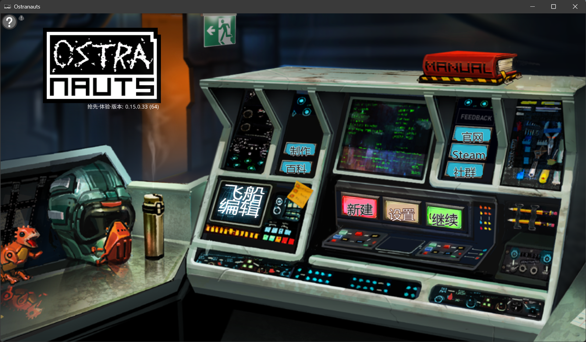
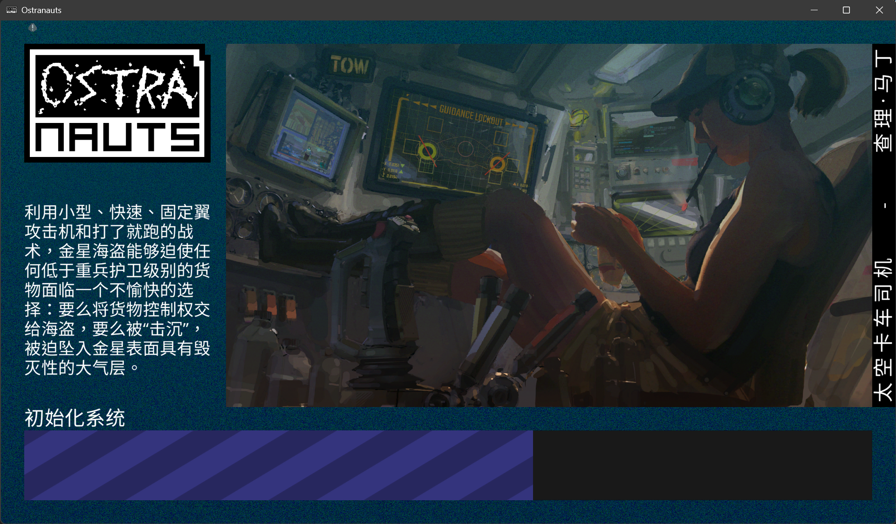
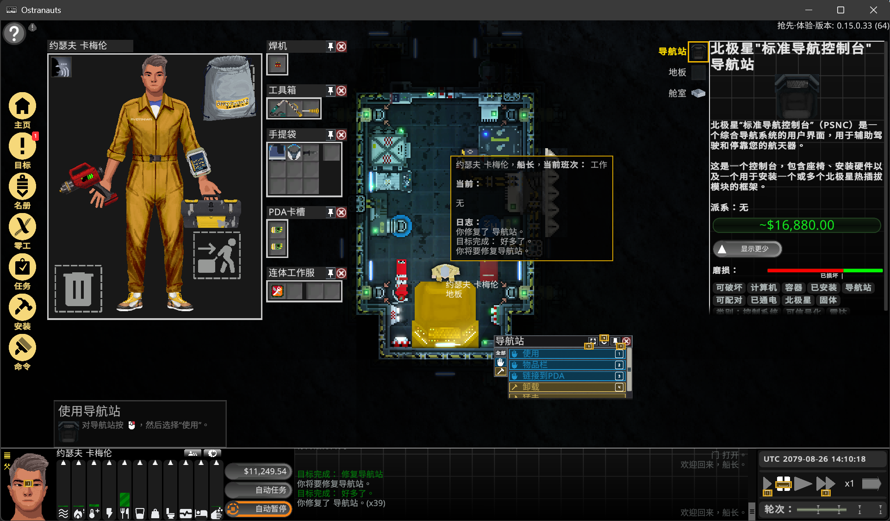
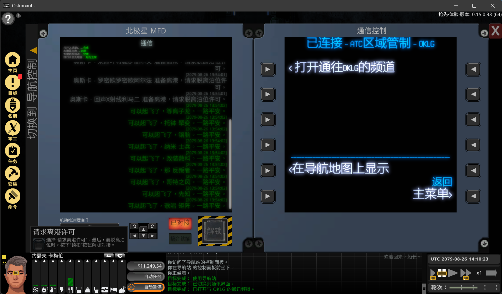
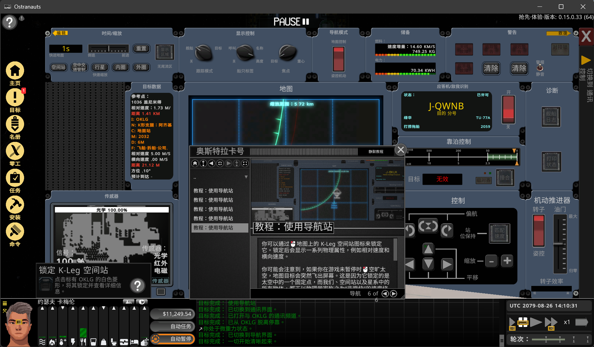

# OstranautsTranslator

Language / 语言: [English](README.md) | [简体中文](README.zh-CN.md)

OstranautsTranslator 是一个面向 Ostranauts 玩家使用的简体中文翻译包。

它首先是给最终用户准备的：下载 release 压缩包，直接解压到游戏目录，然后启动游戏即可。

## 包含内容

- 运行所需的 BepInEx DLL 和配置文件
- doorstop 启动文件
- OstranautsTranslator 插件
- 中文 mod 文件
- 这个翻译包必需的数据库和运行时数据文件
- `config-example.ini`、术语表生成脚本，以及翻译流程会用到的参考术语 JSON 文件

## 安装方法

1. 关闭 Ostranauts。
2. 打开最新 release 页面。
3. 下载 `OstranautsTranslator-v*.zip`。
4. 将压缩包直接解压到游戏根目录，也就是包含 `Ostranauts.exe` 的文件夹。
5. 如果提示覆盖现有文件，选择覆盖。
6. 启动游戏。

## 基本使用

- 正常情况下，安装完成后直接启动游戏即可。
- 如果你想打开翻译状态窗口，可以在游戏里按 `F6`。
- 如果游戏更新后翻译显得过时或不完整，请到 `OstranautsTranslator` 目录运行一次 `OstranautsTranslator.exe`，然后重新启动游戏。
- 如果你想自己运行命令行翻译流程，请先把 `config-example.ini` 复制为 `config.ini`，并在 `OstranautsTranslator` 目录中填入你自己的 API key。

## 效果截图

下面是游戏内简体中文翻译效果示例：

### 截图 1

### 截图 2

### 截图 3

### 截图 4

### 截图 5

## 更新方法

升级到新版本时：

1. 关闭游戏。
2. 下载新的 release 压缩包。
3. 仍然解压到同一个游戏根目录。
4. 覆盖现有文件。

## 卸载方法

如果你想卸载这个翻译包，可以从游戏目录删除这些路径：

- `BepInEx`
- `doorstop_config.ini`
- `winhttp.dll`
- `OstranautsTranslator`
- `Ostranauts_Data\Mods\OstranautsTranslate`

如果你在安装这个包之前就已经有自己的 BepInEx 环境，请只删除这个 release 带来的文件。

## 常见问题

- 翻译没有生效：
  确认压缩包是解压到了包含 `Ostranauts.exe` 的目录，而不是多套了一层子目录。
- 游戏更新后部分文本不对或漏翻：
  先运行一次 `OstranautsTranslator.exe`，然后重启游戏。
- 想确认翻译包是否已经正常加载：
  启动游戏后按 `F6`，如果能打开状态窗口，说明插件已经加载。

## 下载

最终用户请直接从 GitHub Releases 页面下载最新打包版本。